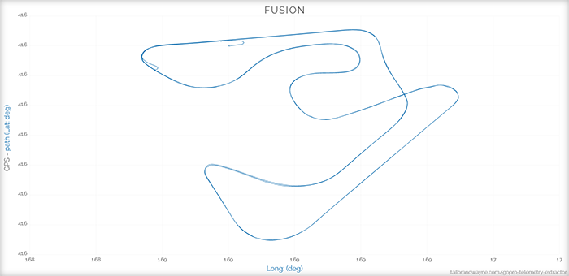

# d3-proportional-ranges

This module modifies data extents so that they scale without losing proportions. It is useful for representing 2D data with the same units on both axis, for example, geographic features when the scale does not require fully fledged projections. It accepts the x and y ranges of both the origin domain and the destination range, and outputs new origin domains with the same proportion as the range, but without altering the aspect ratio of the relevant data. That is, it creates margins in either X or Y.

## Installation

```shell
$ npm i d3-proportional-ranges
```

## Usage

Within a D3 program, it could work like this:

```js
const proportionalRanges = require('d3-proportional-ranges');

//Input 4 arrays with: extent of X domain, extent of Y domain, range of X output, range of Y output
const pathDomain = proportionalRanges([0, 1000], [0, 500], [0, innerWidth], [0, innerHeight]);

const xScale = scaleLinear()
  .domain(pathDomain.x)
  .range([0, innerWidth]);
const yScale = scaleLinear()
  .domain(pathDomain.y)
  .range([innerHeight, 0]);
```

## Example output

Here the GPS path (the domain) keeps its ratio while the ratio of the screen (the range) changes from landscape to portrait.

<p align="center">
  
  
</p>

## Notes

Please report any problem, as this has not been thoroughly tested and could be improved.
This module works outside of D3. It was created for the [GoPro Telemetry Extractor](https://tailorandwayne.com/gopro-telemetry-extractor/#)

## More creative coding

If you liked this you might like other [creative coding projects](https://tailorandwayne.com/coding-projects/).

test
